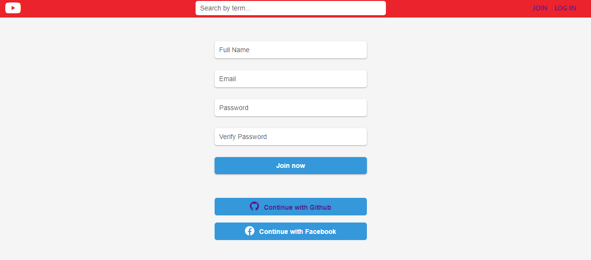

# Youtube Clone 📹 ( ⛔ 구현중...)

Cloning Youtube with React and NodeJS

## 주요기능

    ✅ 클라이언트(React) / 서버(Node)
    
    ✅ 컴포넌트 디자인 : Ant Design

    ✅ 깃허브, 카카오톡 로그인
    
    ✅ 영상 CRUD
      
    ✅ 댓글, 좋아요 기능
    

    
## 사용언어 / 도구

<!--

-->

## Preview 

  👨‍👧‍👧 Join
 

